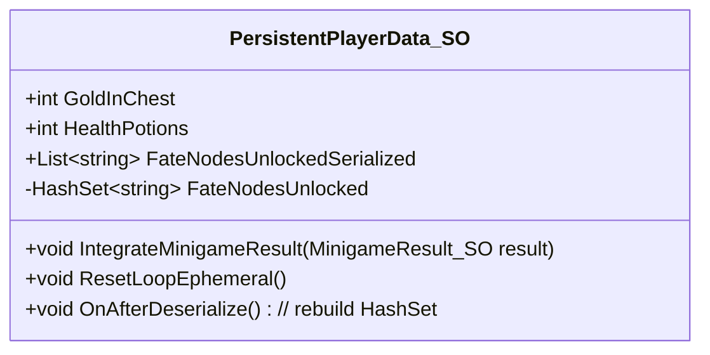

# PersistentPlayerData_SO Structure

This document describes the structure and responsibility of the PersistentPlayerData_SO asset.

## Conceptual Structure Diagram

## Stored Data Categories

| Field | Type | Description |
| --- | --- | --- |
| GoldInChest | int | Gold saved in persistent chest |
| HealthPotions | int | Health Potion count (persists across loops) |
| FateNodesUnlockedSerialized | List<string> | Serialized version of unlocked nodes |
| FateNodesUnlocked | HashSet<string> | Permanently unlocked fate nodes (e.g., “Chess Master”) |
| IntegrateMinigameResult() | Method | Merges minigame result into persistent state |
| ResetLoopEphemeral() | Method | Reset the non-persistent part |
| OnAfterDeserialize() | Method | Syncs HashSet after load |

## Design Notes

- This ScriptableObject represents authoritative persistent state
- It is treated as immutable during active gameplay
- Modifications occur only at the loop end after validation
