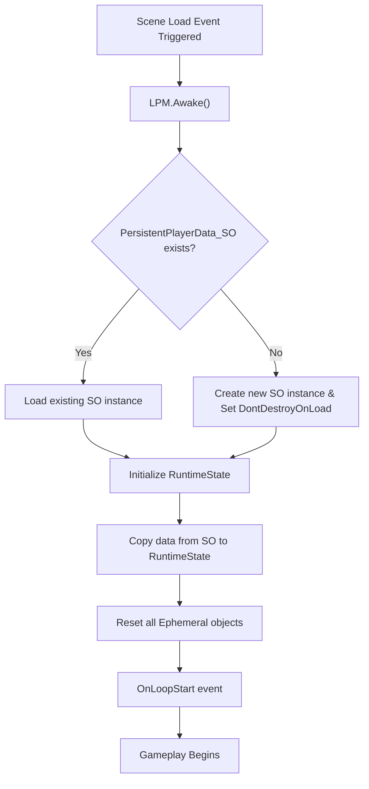

# LPM Flow – Loop Start (Scene Load)

This document describes the responsibilities of the Loop Persistence Manager when a new loop begins.

## Flow Diagram

## Sequence

1. Load PersistentPlayerData_SO
2. Initialize LPM_RuntimeState from persistent data
3. Initialize world and gameplay systems
4. Enable player input and begin gameplay

## Guarantees

- Persistent data is never modified during initialization
- Runtime state starts from a deterministic baseline
- All ephemeral state is freshly created
