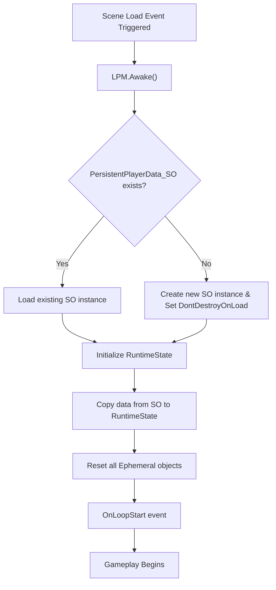

# LPM Flow – Loop Start (Scene Load)

This document describes the responsibilities of the Loop Persistence Manager when a new loop begins.

## Flow Diagram

## Sequence

1. `LPM.Awake()` checks for existing `PersistentPlayerData_SO` . If another `LPM` or `PersistentPlayerData_SO` instance exists, destroy duplicates to ensure a single persistent source.
2. If no→ Create new SO instance + `DontDestroyOnLoad`
3. Load persistent data from SO → write to `LPM_RuntimeState`
4. Reset all Ephemeral objects
5. Trigger `GameEvents.OnLoopStart?.Invoke()`

## Guarantees

- Persistent data is never modified during initialization
- Runtime state starts from a deterministic baseline
- All ephemeral state is freshly created
