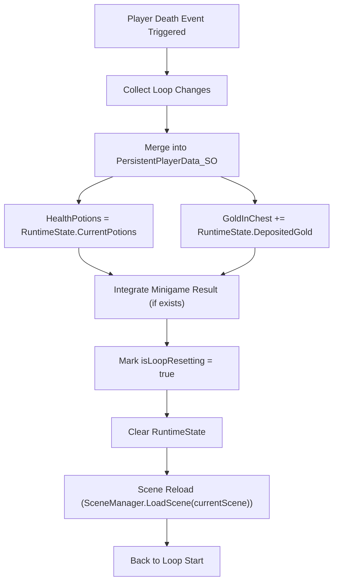

# LPM Flow – Loop End (Reset)

This document describes how the system handles loop termination caused by player death or day completion.

## Flow Diagram

## Sequence

1. Freeze gameplay systems
2. Validate runtime state
3. Commit approved changes to persistent data
4. Discard all ephemeral data
5. Reload the scene

## Guarantees

- Only explicitly approved progress persists
- No ephemeral state leaks into the next loop
- Scene reload restores a clean baseline
