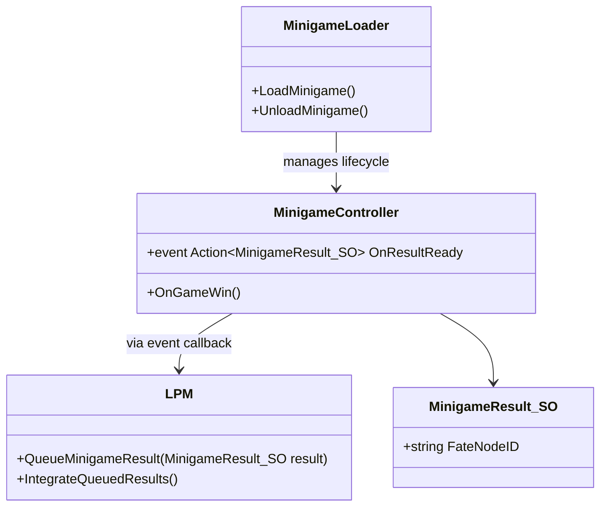

# Minigame Integration

Minigames are treated as independent subsystems that do not require the core game environment to be destroyed or reloaded.

## Integration Diagram

## **Integration Flow:**

1. `MinigameLoader` loads the Magical Chess Minigame as an **Additive Scene**.
2. When the player wins, `MinigameController` emits an `OnResultReady` event.
3. LPM receives the event and calls `QueueMinigameResult(result)`.
4. At Loop End, LPM runs `IntegrateQueuedResults()` to merge results.
5. Minigames can be developed and tested independently, without relying on the main Loop.

***Note:*** In practice, `MinigameResult_SO` can be instantiated via `ScriptableObject.CreateInstance` or replaced with a lightweight serializable class if no asset persistence is needed.

## Design Rationale

- Prevents tight coupling between core gameplay and minigames
- Allows minigames to evolve independently
- Ensures persistent data integrity
