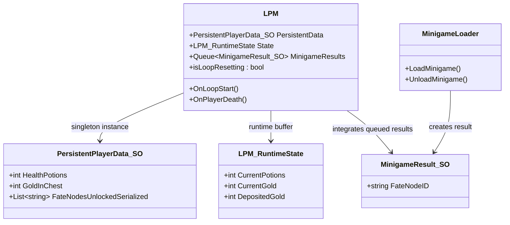

# Overall UML Overview

This document provides a high-level conceptual overview of the system architecture.

## UML Overview Diagram

## Scalability Design

| Feature | Implement |
| --- | --- |
| Multiple minigames | Unified `MinigameResult` payload and event callback |
| Multiple player data | `PersistentPlayerData_SO` + `player ID` |

## Summary

The architecture centralizes loop control while maintaining strict data ownership boundaries.
This design minimizes coupling, improves testability, and supports future expansion.
